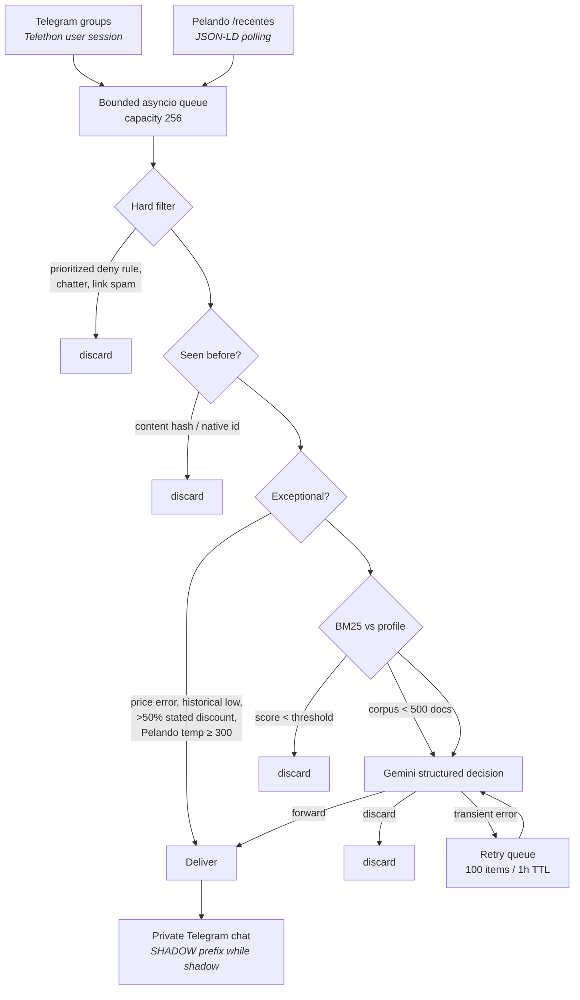

<div align="center">

# Sieve

**A bounded, single-process promotion filter for Telegram and Pelando — BM25 pre-ranking, Gemini for the final call.**

<p>
  <a href="#how-it-works">How it works</a> •
  <a href="#quick-start">Quick start</a> •
  <a href="#configuration">Configuration</a> •
  <a href="#cli-reference">CLI</a> •
  <a href="#rollout">Rollout</a>
</p>

<p>
  
  
  
  
  
</p>

</div>

---

## Overview

Sieve watches deal-sharing Telegram groups and the Pelando `/recentes` feed, throws away
everything that doesn't match a written preference profile, and forwards the survivors to a
private Telegram chat.

The point is cost and noise control. Most promotions never reach the LLM: fixed spam checks and
prioritized, declarative hard rules reject unwanted categories; deduplication kills reposts; a
rolling Okapi BM25 score against the profile kills weak lexical matches. Only what's left is sent
to Gemini, which returns a structured `forward` / `discard` decision.

It's designed to sit on a Raspberry Pi 4B (2 GB) indefinitely: one process, a bounded queue, a
256 MB container cap, a 220 MB in-app tripwire that restarts before the OOM killer does, and a
SQLite WAL database that prunes itself.

> [!IMPORTANT]
> Fresh deployments run in **shadow mode**. Shadow deliveries land in the same private chat with a
> visible `SHADOW` prefix and a silent notification, so you can calibrate against real traffic
> without trusting the filter yet. Switching to `live` is a deliberate, staged decision — see
> [Rollout](#rollout).

---

## How it works



### Stage notes

| Stage                  | Behaviour                                                                                                                                                                                                                                                                                                                              |
| ---------------------- | -------------------------------------------------------------------------------------------------------------------------------------------------------------------------------------------------------------------------------------------------------------------------------------------------------------------------------------- |
| **Hard filter**        | Fixed spam checks run first. Ordered, token-aware `allow`/`deny` rules then use the first matching priority, so narrow exceptions can precede broader category denials without competing regex and substring systems. Rules live in YAML. |
| **Deduplication**      | Exact content hash and native source ID, persisted in SQLite.                                                                                                                                                                                                                                                                          |
| **Exceptional bypass** | Skips BM25 _and_ the LLM entirely. Triggers: Pelando temperature ≥ `exceptional_temperature`, explicit phrases (`erro de preço`, `menor preço histórico`, `price error`, …), or a parsed stated discount above 50%.                                                                                                                    |
| **BM25**               | In-project Okapi BM25 (`k1=1.2`, `b=0.75`) against a rolling 10,000-document corpus, with bidirectional alias expansion. **Fails open** while the corpus holds fewer than `cold_start_documents` (500) — everything reaches the LLM until statistics are meaningful.                                                                   |
| **Gemini**             | Structured JSON decision, minimal thinking budget, ≤160 output tokens, no conversation history, 3 retries on transient failure.                                                                                                                                                                                                        |
| **Delivery**           | Single-claim delivery per promotion, so a restart mid-send can't double-post.                                                                                                                                                                                                                                                          |

### Design properties

- **Source-neutral core.** A `Promotion` dataclass plus `PromotionSource`, `PipelineStage`,
  `LLMEvaluator`, `PromotionSink` and `StateStore` protocols. Every implementation is resolved from
  a `module:factory` string in YAML — a new source drops in without touching the pipeline.
- **Bounded everywhere.** Input queue 256, retry queue 100 items / 1 hour TTL, corpus 10,000 docs,
  audit history 30 days or 50,000 rows, incremental pruning.
- **No media downloads.** Telegram ingestion reads text and media captions only.
- **Locked-down container.** Non-root user, read-only root filesystem, all capabilities dropped,
  `no-new-privileges`, 64 PIDs, 16 MB tmpfs, 10 MB × 3 log rotation.
- **Observable.** JSON logs to stdout; alerts for source failures, schema drift, database errors,
  LLM outages and memory pressure.

---

## Quick start

### Requirements

- Docker and Docker Compose (or Python 3.12+ for local runs)
- A Telegram **user account** with [API credentials](https://my.telegram.org) — this is what reads
  the groups
- A separate Telegram **bot** that already has an open private conversation with your account —
  this is what delivers
- A Gemini API key

### 1. Configure secrets

```bash
git clone https://github.com/koobzaar/Sieve.git
cd Sieve
cp .env.example .env
cp config/config.local.example.yaml config/config.local.yaml
```

Fill in `.env`:

```dotenv
TELEGRAM_API_ID=
TELEGRAM_API_HASH=
TELEGRAM_BOT_TOKEN=
TELEGRAM_PRIVATE_CHAT_ID=
GEMINI_API_KEY=
```

> [!WARNING]
> Both `.env` and `config/config.local.yaml` are gitignored — keep them that way. The tracked
> `config/config.yaml` contains safe shared defaults; put your personal profile, group IDs and
> rule tuning only in the local override.

### 2. Authenticate the Telegram user session

Interactive, one time only. Telethon writes the session file into the persistent `/state` volume.

```bash
docker compose run --rm sieve \
  --config /app/config/config.local.yaml auth-telegram --source telegram-principal
```

Enter the login code and 2FA password when prompted. Then set the source's numeric `chat_ids` and
`enabled: true` in `config/config.local.yaml`.

### 3. Validate and run

```bash
docker compose run --rm sieve --config /app/config/config.local.yaml validate-config
docker compose config
docker compose up -d --build
docker compose logs -f sieve
```

Health is checked automatically every 60s via the `health` subcommand — it verifies
`PRAGMA quick_check` and a runtime heartbeat newer than 180 seconds.

<details>
<summary><b>Running without Docker</b></summary>

```bash
python -m venv .venv
.venv/bin/pip install -e .
.venv/bin/sieve --config config/config.local.yaml run
```

You'll need to point `state.path` and `session_path` at writable local directories instead of
`/state`. On Windows use `.venv\Scripts\`.

</details>

---

## Configuration

Shared, non-personal defaults live in [`config/config.yaml`](config/config.yaml). Copy
[`config/config.local.example.yaml`](config/config.local.example.yaml) to
`config/config.local.yaml` for your personal profile, source IDs and filtering preferences. The
local file uses `extends: config.yaml`; mappings merge recursively, `sources` merge by `name`,
`hard_rules` merge by `id`, and other lists replace their parent value. Secrets are read from
environment variables named _by_ the config, never stored in either file.

<details>
<summary><b>Key sections</b></summary>

| Block       | Notable keys                                                                                                                |
| ----------- | --------------------------------------------------------------------------------------------------------------------------- |
| `runtime`   | `mode` (`shadow`/`live`), `queue_capacity`, `memory_limit_mb`, `failure_alert_threshold`, `llm_outage_alert_seconds`        |
| `state`     | `path`, `retention_days`, `retention_cap`, `corpus_limit`, `retry_limit`, `retry_ttl_seconds`                               |
| `pipeline`  | `bm25_threshold`, `bm25_k1`, `bm25_b`, `cold_start_documents`, `exceptional_temperature`, `profile`, `aliases`, `hard_rules` |
| `evaluator` | `factory`, model name, provider URL, timeout, `max_output_tokens`, `retries`                                                |
| `sink`      | `factory`, token/chat-ID env var names, API URL, timeout                                                                    |
| `sources`   | list of `{name, factory, enabled, mode, settings}`                                                                          |

</details>

The **profile** is a free-text paragraph describing what you want and what you don't. It's used two
ways: tokenized into the BM25 query, and passed to Gemini as the judging criterion. Tuning it is
most of the calibration work.

**Aliases** are bidirectional — `placa_video: ["gpu", "graphics card", "geforce", "radeon"]` means a
listing mentioning any of those terms matches the profile's mention of any other.

**Hard rules** are evaluated in ascending numeric `priority` after the fixed spam checks. Each rule
has a stable `id`, an `allow` or `deny` action, and either `any` phrases or `all` groups. Phrase
matching is accent-insensitive and token-aware. The first matching rule wins, which makes narrow
allows predictable and leaves generic products to broader denials.

Per-source `mode` overrides `runtime.mode`, which is what lets you promote one Telegram group to
`live` while everything else stays in shadow.

---

## CLI reference

The `sieve` entrypoint takes a global `--config` and `--log-level`, then a subcommand.

| Command                                          | Purpose                                                                        |
| ------------------------------------------------ | ------------------------------------------------------------------------------ |
| `run`                                            | Start the service.                                                             |
| `auth-telegram [--source NAME] [--phone NUMBER]` | Create or refresh the persisted Telethon user session.                         |
| `replay FIXTURE [--no-fail]`                     | Score pre-LLM filtering against a labeled JSONL file.                          |
| `health`                                         | Print JSON health status; exit 1 if unhealthy. Used by the Docker healthcheck. |
| `validate-config`                                | Parse the YAML without touching secrets.                                       |

---

## Replay calibration

Replay measures how well the pre-LLM stages perform against labeled data — the whole point being to
verify you're not paying Gemini for obvious junk, and not silently dropping deals you wanted.

Each JSONL line is a `Promotion.to_dict()` payload plus a `relevant` boolean, either flat or nested
under a `promotion` key. See [`fixtures/labeled.example.jsonl`](fixtures/labeled.example.jsonl) for
the shape.

```bash
sieve --config config/config.local.yaml replay fixtures/labeled.example.jsonl
```

The command exits non-zero unless pre-LLM filtering **rejects ≥90% of labeled irrelevant deals**
while **retaining ≥95% of relevant ones**. Use `--no-fail` to print metrics without the gate.

> [!NOTE]
> Replay runs against a fully warmed offline corpus. The live pipeline still fails open to Gemini
> for its first 500 accepted corpus documents, so early live behaviour will be more permissive than
> replay suggests. The bundled two-line fixture documents the format only — it is not a dataset.

---

## Tests

```bash
python -m venv .venv
.venv/bin/pip install -e ".[test]"
.venv/bin/python -m pytest
```

On Windows PowerShell, use `.venv\Scripts\pip` and `.venv\Scripts\python`.

Tests never touch live services. They run against saved HTML/JSON-LD fixtures, synthetic events,
mocked HTTP transports, deterministic clocks and temporary SQLite files. The suite covers BM25,
normalization, filters and exceptional detection, source parsing, evaluator and sink contracts,
store behaviour, Telegram reconnection, pipeline integration, replay, and a `soak`-marked
100,000-promotion bounded-memory run.

```bash
.venv/bin/python -m pytest -m "not soak"   # skip the long one
```

---

## Rollout

Shadow mode exists because a filter that silently eats a good deal is worse than one that's noisy.
Advance one step at a time:

- [ ] Run the full suite — fixture, contract, integration, recovery and soak tests
- [ ] Run **all** sources in shadow for seven days
- [ ] Review replay metrics; tune only profile, aliases, hard rules and thresholds
- [ ] Promote **one** Telegram source to `live` for 48 hours
- [ ] Enable remaining Telegram sources, then Pelando

Do not advance unless all of the following hold: no duplicate live deliveries, no sustained memory
growth, clean recovery across restarts, and the 90% rejection / 95% retention targets met.

---

## Project layout

```
promo_bot/
├── cli.py            # argparse entrypoint, subcommands
├── runtime.py        # service orchestration, queues, alerts, memory tripwire
├── pipeline.py       # filter → dedup → exceptional → BM25 → LLM → deliver
├── models.py         # Promotion, Decision, Evaluation, PipelineResult, RetryJob
├── protocols.py      # Source / Stage / Evaluator / Sink / Store interfaces
├── config.py         # YAML loading, factory resolution, env secrets
├── filters.py        # fixed spam checks and prioritized token-aware hard rules
├── exceptional.py    # price-error / historical-low / discount bypasses
├── bm25.py           # Okapi BM25
├── normalization.py  # tokenization, alias expansion, content hashing
├── store.py          # SQLite WAL: corpus, dedup, retries, audit, health
├── evaluator.py      # Gemini structured-decision client
├── sink.py           # Telegram bot delivery + alerts
├── replay.py         # offline calibration metrics
├── logging.py        # JSON stdout logging
└── sources/
    ├── telegram.py   # Telethon user-session ingestion
    └── pelando.py    # conditional /recentes polling, JSON-LD parsing
```

---

## Credits

Telethon lifecycle handling follows the [stable Telethon documentation](https://docs.telethon.dev/en/stable/).
Pelando structured-feed parsing follows the precedent set by [ffirenn/pelando_bot](https://github.com/ffirenn/pelando_bot).

## License

Sieve is available under the [MIT License](LICENSE).
