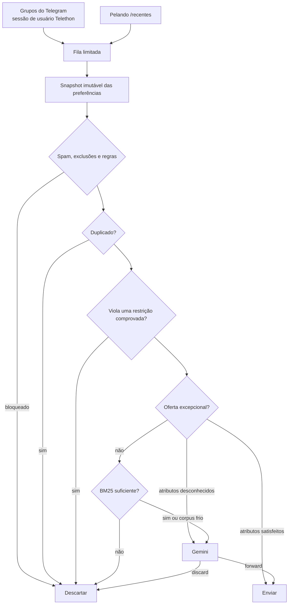

[Português (Brasil)](README.md) | [English](README.en.md)

<div align="center">

# Sieve

**Filtro de promoções para Telegram e Pelando com preferências ao vivo, BM25 e decisão final do Gemini.**

<p>
  <a href="#como-funciona">Como funciona</a> •
  <a href="#instalação-rápida">Instalação rápida</a> •
  <a href="#configuração-principal">Configuração</a> •
  <a href="#cli">CLI</a> •
  <a href="#testes">Testes</a>
</p>

<p>
  
  
  
  
  
</p>


</div>

O Sieve acompanha grupos do Telegram e a página `/recentes` do Pelando, descarta ruído e envia
somente as promoções relevantes para uma conversa privada. Ele foi projetado para funcionar
continuamente em hardware pequeno: processo único, filas limitadas, SQLite em modo WAL e limite de
memória do contêiner.

> [!IMPORTANT]
> Uma instalação nova começa em modo `shadow`. As promoções são enviadas silenciosamente como
> teste até você validar os filtros e mudar deliberadamente para `live`.

## Como funciona



A ordem é intencional:

1. verificações fixas de spam e exclusões explícitas;
2. regras prioritárias `allow`/`deny`;
3. deduplicação persistente;
4. restrições determinísticas de preço e atributos;
5. tratamento de ofertas excepcionais;
6. relevância lexical ponderada com BM25;
7. avaliação estruturada do Gemini.

Uma violação de preço identificada com segurança nunca é ignorada por uma oferta “excepcional”. Se
uma oferta excepcional parece relevante, mas não é possível comprovar um atributo obrigatório, ela
vai ao Gemini em vez de ser descartada pelo BM25.

## Interface privada e acessível

O bot de entrega também oferece uma interface de preferências em inglês e português brasileiro. Na
primeira mensagem, o idioma do Telegram é usado como sugestão; depois, a escolha fica salva no
SQLite. Use `/language` a qualquer momento para trocar.

A interface foi feita para ser descoberta sem decorar comandos:

- `/start` apresenta o Sieve e mostra exemplos;
- botões com texto completo abrem **Preferências**, **Histórico**, **Ajuda** e **Idioma**;
- telas longas de preferências têm paginação;
- mensagens explicam o resultado e o próximo passo;
- HTML dá hierarquia visual sem depender somente de cor ou emoji;
- o menu de comandos é localizado pelo idioma do Telegram;
- textos dinâmicos são escapados antes da formatação.

Essas escolhas seguem os recursos oficiais de [formatação HTML e teclados inline da Bot
API](https://core.telegram.org/bots/api) e a orientação de descoberta por `/start`, `/help` e menu
de comandos em [Telegram Bot Features](https://core.telegram.org/bots/features).

Também é possível conversar naturalmente:

```text
Tenho interesse em monitores OLED até R$ 3.000
Não quero promoções de perfumes
Eu já tenho um PlayStation 5
Mostre minhas preferências
```

Atalhos determinísticos não usam Gemini:

| Comando | Resultado |
| --- | --- |
| `/preferences` | Mostra o estado autoritativo atual |
| `/history` | Mostra revisões recentes |
| `/preview <instrução>` | Interpreta e valida sem salvar |
| `/undo` | Desfaz a última mudança por meio de uma nova revisão |
| `/confirm <id>` | Confirma exatamente uma solicitação pendente |
| `/cancel <id>` | Cancela exatamente uma solicitação pendente |
| `/language` | Escolhe inglês ou português brasileiro |
| `/help` | Explica as opções e proteções |

Mudanças pequenas são aplicadas imediatamente. Regras de segurança, exclusões em massa, mudanças em
mais de cinco entradas, restaurações por data e `undo` com várias entradas exigem confirmação. Os
botões dizem **Confirmar alteração** e **Cancelar**, expiram em dez minutos e ficam inválidos quando
a revisão base muda. Um “sim” isolado nunca confirma uma operação destrutiva.

## A matemática

### Pontuação BM25

Para cada termo `t` da consulta de preferências e documento de promoção `d`, o Sieve usa Okapi BM25:

```text
score(q, d) = Σ IDF(t) · [ f(t,d) · (k₁ + 1) ]
                         ───────────────────────── · w(t)
                         f(t,d) + k₁ · (1 - b + b · |d| / avgdl)
```

onde:

- `f(t,d)` é a frequência do termo na promoção;
- `|d|` é o número de termos da promoção;
- `avgdl` é o tamanho médio das promoções do corpus;
- `k₁ = 1,2` controla a saturação da frequência;
- `b = 0,75` controla a normalização por tamanho;
- `w(t)` é o peso produzido pela importância da preferência.

A raridade do termo é:

```text
IDF(t) = ln(1 + (N - df(t) + 0,5) / (df(t) + 0,5))
```

`N` é o total de documentos no corpus e `df(t)` é quantos documentos contêm `t`. Portanto, um termo
raro como um modelo específico normalmente informa mais do que uma palavra comum como “oferta”.

### Importância de 0 a 100

A importância `I` de um interesse é convertida linearmente em multiplicador:

```text
w(I) = 0,5 + I / 100,     0 ≤ I ≤ 100
```

| Importância | Multiplicador | Interpretação |
| ---: | ---: | --- |
| `0` | `0,5×` | reduz pela metade a contribuição |
| `50` | `1,0×` | preserva o comportamento original |
| `100` | `1,5×` | aumenta em 50% a contribuição |

Aliases expandem os termos indexados sem alterar o texto original armazenado. Entradas de contexto
informam o Gemini, mas não tornam um produto lexicalmente relevante por conta própria.

### Restrições com três resultados

Preço e atributos são avaliados como `satisfeito`, `violado` ou `desconhecido`:

```text
violado    → descartar antes do bypass excepcional
satisfeito → a oferta excepcional pode seguir o bypass normal
desconhecido + oferta excepcional possivelmente relevante → enviar ao Gemini
```

Esse terceiro estado evita transformar ausência de informação em uma conclusão falsa.

### Limites deslizantes

Comandos que usam Gemini são contados em duas janelas persistentes:

```text
contagem(agora - 60 s, agora]  < 5
contagem(agora - 3600 s, agora] < 20
```

Prévias consomem o limite porque chamam o modelo. Consultas determinísticas, confirmações e mensagens
não autorizadas não consomem. O estado persiste após reinicializações.

## Instalação rápida

### Requisitos

- Docker com Docker Compose, ou Python 3.12+;
- credenciais de aplicativo do Telegram em [my.telegram.org](https://my.telegram.org);
- um bot criado pelo BotFather e uma conversa privada já aberta com ele;
- uma chave da API Gemini.

O Sieve usa duas identidades diferentes:

- a **conta de usuário** do Telethon lê os grupos e exige login único por telefone/código;
- o **bot** entrega promoções e recebe comandos por Bot API; ele não faz login por telefone.

### 1. Configuração

```powershell
Copy-Item config/config.local.example.yaml config/config.local.yaml
Copy-Item .env.example .env
```

Preencha `.env` e `config/config.local.yaml`. Nunca faça commit de tokens, chaves ou do arquivo de
sessão do Telegram.

### 2. Login único da conta que lê grupos

No PowerShell, informe o telefone explicitamente ou configure a variável esperada:

```powershell
docker compose run --rm -it sieve --config /app/config/config.local.yaml `
  auth-telegram --source telegram-principal --phone +55SEUNUMERO
```

Esse comando é somente para a sessão Telethon. O bot de entrega usa `TELEGRAM_BOT_TOKEN` diretamente.

### 3. Validar e iniciar

```powershell
docker compose config
docker compose up -d --build
docker compose logs -f sieve
```

Depois, abra a conversa privada com o bot e envie `/start`.

## Preferências e persistência

No primeiro início de um banco novo, o perfil YAML vira uma nota-base sem perda, e aliases e regras
viram entradas individuais na revisão zero. A partir daí, SQLite é autoritativo; o YAML não é
reimportado automaticamente. Excluir o banco de preferências é o único caminho de reseed automático.

Cada alteração cria uma revisão com mensagem original, ator, operações, resumo e snapshot completo.
Restaurações também criam novas revisões—o histórico aplicado nunca é apagado. No commit de uma
revisão, um novo snapshot imutável é trocado atomicamente: a promoção em andamento termina com o
snapshot anterior e a próxima já vê a mudança.

Mudanças de alias iniciam uma reconstrução geracional do índice em lotes de 250 documentos. Enquanto
ela está incompleta, BM25 falha aberto para Gemini para proteger o recall. O índice novo é ativado
atomicamente e o anterior é removido depois.

## Configuração principal

Os padrões compartilhados ficam em [`config/config.yaml`](config/config.yaml). Dados pessoais ficam
em `config/config.local.yaml`, que estende o arquivo principal. Segredos são lidos de variáveis de
ambiente.

| Bloco | Responsabilidade |
| --- | --- |
| `runtime` | modo, capacidade de fila, memória e alertas |
| `state` | caminho SQLite, retenção, corpus e tentativas |
| `pipeline` | BM25, perfil inicial, aliases, regras e ofertas excepcionais |
| `evaluator` | modelo Gemini, timeout e tentativas |
| `preferences` | proprietário, polling, confirmações, limites e parser |
| `sink` | bot e conversa privada de destino |
| `sources` | origens Telegram/Pelando e seus modos |

## CLI

```text
sieve [--config ARQUIVO] [--log-level NÍVEL] run
sieve [--config ARQUIVO] auth-telegram [--source NOME] [--phone NÚMERO]
sieve [--config ARQUIVO] replay FIXTURE [--no-fail]
```

## Testes

```powershell
python -m pip install -e ".[test]"
python -m pytest
$env:RUN_SOAK="1"; python -m pytest -m soak
```

Os testes usam HTTP falso, relógios determinísticos e bancos temporários; não chamam serviços reais.
Eles cobrem autorização, idiomas, formatação HTML, offsets, outbox, revisões, parsing estruturado,
restrições, BM25, reconstruções de aliases, integração e carga.

## Segurança operacional

- chat e remetente precisam coincidir com o proprietário antes de qualquer chamada ao Gemini;
- o bot recusa iniciar o polling quando existe webhook ativo e não o remove automaticamente;
- respostas e offsets só avançam depois que o resultado e a resposta estão duráveis;
- a fila e o outbox têm capacidade limitada;
- o contêiner roda sem root, com sistema de arquivos somente leitura e capacidades removidas;
- entradas são limitadas a 500, estado a 128 KB e propostas a 25 operações.

## Licença

Disponível sob a [Licença MIT](LICENSE).
