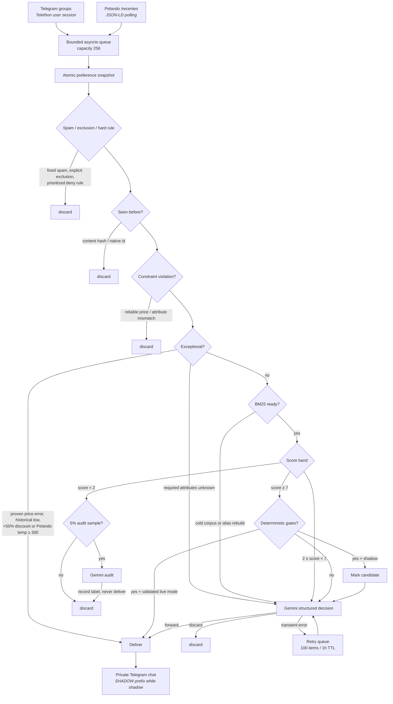

<p align="right">
  <a href="README.pt-BR.md"></a>
  <a href="README.md"></a>
</p>

<div align="center">

# Sieve

**A bounded, single-process promotion filter for Telegram and Pelando with BM25 pre-ranking and artificial intelligence.**

<p>
  <a href="#how-it-works">How it works</a> •
  <a href="#quick-start">Quick start</a> •
  <a href="#configuration">Configuration</a> •
  <a href="#cli-reference">CLI</a> •
  <a href="#rollout">Rollout</a>
</p>

<p>
  
  
  
  
  
</p>

</div>

---

## Overview

Sieve watches deal-sharing Telegram groups and the Pelando `/recentes` feed, throws away
everything that doesn't match a written preference profile, and forwards the survivors to a
private Telegram chat.

To track something, just send the bot a message. You can describe a product by name, set a maximum
price, require a model or attribute, add aliases, or exclude entire categories—no preference syntax
or configuration-file edit is required:

```text
Track Sony WH-1000XM5 headphones under $300
I want OLED monitors with at least 144 Hz
Treat “graphics card” and “GPU” as the same thing
Stop showing me perfume deals
```

The point is cost and noise control. Most promotions never reach the LLM: fixed spam checks and
prioritized, declarative hard rules reject unwanted categories; deduplication kills reposts; a
rolling Okapi BM25 score against the profile kills weak lexical matches. Only what's left is sent
to Gemini, which returns a structured `forward` / `discard` decision.

It's designed to sit on a Raspberry Pi 4B (2 GB) indefinitely: one process, a bounded queue, a
256 MB container cap, a 220 MB in-app tripwire that restarts before the OOM killer does, and a
SQLite WAL database that prunes itself.

> [!IMPORTANT]
> Fresh deployments run in **shadow mode**. Shadow deliveries land in the same private chat with a
> visible `SHADOW` prefix and a silent notification, so you can calibrate against real traffic
> without trusting the filter yet. Switching to `live` is a deliberate, staged decision — see
> [Rollout](#rollout).

---

## How it works



### Stage notes

| Stage                  | Behaviour                                                                                                                                                                                                                                                                                                                              |
| ---------------------- | -------------------------------------------------------------------------------------------------------------------------------------------------------------------------------------------------------------------------------------------------------------------------------------------------------------------------------------- |
| **Spam / exclusions / hard rules** | Fixed spam checks run first, followed by live explicit exclusions. Ordered, token-aware `allow`/`deny` rules use the first matching priority, so narrow exceptions can precede broader category denials. |
| **Deduplication**      | Exact content hash and native source ID, persisted in SQLite.                                                                                                                                                                                                                                                                          |
| **Constraints**        | Reliably matched interest price violations and excluded attributes are discarded before any exceptional bypass. Missing required attributes remain undecided. |
| **Exceptional bypass** | Normally skips BM25 and the LLM. If a promotion may match an interest but its required attributes cannot be proven, it skips BM25 and goes to Gemini instead. |
| **BM25**               | Weighted Okapi BM25 (`k1=1.2`, `b=0.75`) with lower `2.0` and experimental upper `7.0` routing thresholds. Importance `0–100` maps to `0.5×–1.5×`. BM25 fails open to Gemini during cold start and alias rebuilds. |
| **Gemini**             | Structured JSON decision, minimal thinking budget, ≤160 output tokens, no conversation history, 3 retries on transient failure.                                                                                                                                                                                                        |
| **Delivery**           | Single-claim delivery per promotion, so a restart mid-send can't double-post.                                                                                                                                                                                                                                                          |

Gemini promotion evaluation is optional. When `pipeline.gemini_evaluation_enabled` is `false`,
natural-language preference messages still use Gemini, but promotion decisions are deterministic.
Only proven exceptional deals and candidates above the configured BM25 auto-forward threshold
that pass every gate in `live` mode can be delivered. Intermediate or uncertain candidates, cold
corpus items, alias-rebuild items, audits, and pending evaluation retries are discarded without a
Gemini request.

### Design properties

- **Source-neutral core.** A `Promotion` dataclass plus `PromotionSource`, `PipelineStage`,
  `LLMEvaluator`, `PromotionSink` and `StateStore` protocols. Every implementation is resolved from
  a `module:factory` string in YAML — a new source drops in without touching the pipeline.
- **Bounded everywhere.** Input queue 256, preference queue/outbox 20, retry queue 100 items / 1
  hour TTL, corpus 10,000 docs, preference state 500 entries / 128 KB, incremental pruning.
- **Live revisioned preferences.** YAML seeds revision zero once. SQLite is authoritative after
  that, every mutation is audited, and each promotion keeps one immutable snapshot for its full run.
- **No media downloads.** Telegram ingestion reads text and media captions only.
- **Locked-down container.** Non-root user, read-only root filesystem, all capabilities dropped,
  `no-new-privileges`, 64 PIDs, 16 MB tmpfs, 10 MB × 3 log rotation.
- **Observable.** JSON logs to stdout; Telegram alerts for transport and other source failures,
  database errors, LLM outages and memory pressure. Pelando schema drift stays visible in structured
  logs and the persisted health snapshot without sending Telegram alerts.

### The math

For query term `t` and promotion document `d`, Sieve uses weighted Okapi BM25:

```text
score(q, d) = Σ IDF(t) · [ f(t,d) · (k₁ + 1) ]
                         ───────────────────────── · w(t)
                         f(t,d) + k₁ · (1 - b + b · |d| / avgdl)
```

with inverse document frequency:

```text
IDF(t) = ln(1 + (N - df(t) + 0.5) / (df(t) + 0.5))
```

`f(t,d)` is term frequency, `|d|` is promotion length, `avgdl` is average corpus document length,
and `df(t)` is the number of corpus documents containing the term. The defaults are `k₁=1.2` and
`b=0.75`. Rare, specific terms consequently carry more evidence than common deal vocabulary.

Interest importance `I` is mapped linearly from `0–100` to a term multiplier:

```text
w(I) = 0.5 + I / 100,     0 ≤ I ≤ 100
```

Thus `0 → 0.5×`, `50 → 1.0×`, and `100 → 1.5×`. Aliases expand indexed terms without changing the
stored source text. Context informs Gemini but does not independently add BM25 relevance.

#### Why the thresholds are 2 and 7

BM25 is neither a percentage nor a probability: its scale changes with `N`, `df(t)`, document
length, aliases, and weights. For an average-length promotion containing a term once, the saturation
fraction is exactly `1`:

```text
f = 1 and |d| = avgdl  →  f·(k₁+1) / (f+k₁) = 1
term contribution ≈ IDF(t) · w(t)
```

At the first stable corpus size, `N = 500`, representative values are:

| Corpus frequency | `IDF(t)` | Contribution at weight `1.0` |
| ---: | ---: | ---: |
| `df = 1` | `5.81` | `≈ 5.81` |
| `df = 10` | `3.87` | `≈ 3.87` |
| `df = 50` | `2.29` | `≈ 2.29` |

The `2.0` cutoff removes weak lexical matches; `7.0` creates a strong-score observation band. It is
not proof of relevance: one maximally weighted rare term can contribute `5.81 × 1.5 ≈ 8.72` by
itself. A candidate must therefore also match a literal term from a structured interest, prove all
required constraints, and not look like an accessory when the interest targets the main product.
Aliases affect BM25 but cannot satisfy that literal gate alone.

```text
score < 2.0       → discard; audit 5% with Gemini without ever delivering
2.0 ≤ score < 7.0 → Gemini decides
score ≥ 7.0       → apply gates; shadow records a candidate and still lets Gemini decide
BM25 unavailable → Gemini decides
```

`7.0` is an experimental starting point, not a universal mathematical optimum. Live mode should
only be considered after at least 300 eligible shadow candidates with no confirmed false forward.
With zero failures in `n` observations, the rule of three puts the approximate 95% upper risk bound
at `3/n`, or about `1%` for `n = 300`. A cold corpus or alias rebuild returns all decisions to
Gemini.

Price and attribute constraints use three-valued logic: `satisfied`, `violated`, or `unknown`. A
proven violation is discarded before exceptional handling; a proven match keeps the usual bypass;
an unknown required attribute on a potentially relevant exceptional deal goes to Gemini. This
avoids treating missing information as evidence either way.

---

## Quick start

### Requirements

- Docker and Docker Compose (or Python 3.12+ for local runs)
- A Telegram **user account** with [API credentials](https://my.telegram.org) — this is what reads
  the groups
- A separate Telegram **bot** that already has an open private conversation with your account —
  this is what delivers
- A Gemini API key for natural-language preference messages and, by default, promotion evaluation

### 1. Configure secrets

```bash
git clone https://github.com/koobzaar/Sieve.git
cd Sieve
cp .env.example .env
cp config/config.local.example.yaml config/config.local.yaml
```

Fill in `.env`:

```dotenv
TELEGRAM_API_ID=
TELEGRAM_API_HASH=
TELEGRAM_BOT_TOKEN=
TELEGRAM_PRIVATE_CHAT_ID=
GEMINI_API_KEY=
```

> [!WARNING]
> Both `.env` and `config/config.local.yaml` are gitignored — keep them that way. The tracked
> `config/config.yaml` contains safe shared defaults; put your personal profile, group IDs and
> rule tuning only in the local override.

### 2. Authenticate the Telegram user session

Interactive, one time only. Telethon writes the session file into the persistent `/state` volume.

```bash
docker compose run --rm sieve \
  --config /app/config/config.local.yaml auth-telegram --source telegram-principal
```

Enter the login code and 2FA password when prompted. Then set the source's numeric `chat_ids` and
`enabled: true` in `config/config.local.yaml`.

### 3. Validate and run

```bash
docker compose run --rm sieve --config /app/config/config.local.yaml validate-config
docker compose config
docker compose up -d --build
docker compose logs -f sieve
```

Health is checked automatically every 60s via the `health` subcommand — it verifies
`PRAGMA quick_check` and a runtime heartbeat newer than 180 seconds.

<details>
<summary><b>Running without Docker</b></summary>

```bash
python -m venv .venv
.venv/bin/pip install -e .
.venv/bin/sieve --config config/config.local.yaml run
```

You'll need to point `state.path` and `session_path` at writable local directories instead of
`/state`. On Windows use `.venv\Scripts\`.

</details>

---

## Supported promotion sources

Built-in sources are disabled in the shared configuration so each installation explicitly chooses
where its promotions come from. The local example enables Telegram and leaves Pelando disabled.

| Source | Coverage | Default | Required settings |
| --- | --- | --- | --- |
| Telegram groups/channels | Any groups or channels accessible to your Telegram user account | Disabled | Telethon API credentials, a persisted user session, and `chat_ids` |
| [Pelando `/recentes`](https://www.pelando.com.br/recentes) | Brazil-focused deal website | Disabled | No account; optional polling interval, timeout, and user agent |

Enable or disable each source independently in `config/config.local.yaml`:

```yaml
sources:
  - name: telegram-principal
    enabled: true
    settings:
      chat_ids: [-1001234567890]

  - name: pelando
    enabled: false
```

At least one source must be enabled before `run`. To add another website, implement the
`PromotionSource` protocol and a factory that accepts the configured settings, `name`, shared HTTP
client, and health reporter; then reference it with a `module:factory` path under `sources`. The
pipeline does not need source-specific changes.

> [!WARNING]
> Pelando used to be enabled by the shared configuration. After upgrading, add the `pelando` entry
> above with `enabled: true` if you want to keep ingesting it.

---

## Configuration

Shared, non-personal defaults live in [`config/config.yaml`](config/config.yaml). Copy
[`config/config.local.example.yaml`](config/config.local.example.yaml) to
`config/config.local.yaml` for your personal profile, source IDs and filtering preferences. The
local file uses `extends: config.yaml`; mappings merge recursively, `sources` merge by `name`,
`hard_rules` merge by `id`, and other lists replace their parent value. Secrets are read from
environment variables named _by_ the config, never stored in either file.

<details>
<summary><b>Key sections</b></summary>

| Block       | Notable keys                                                                                                                |
| ----------- | --------------------------------------------------------------------------------------------------------------------------- |
| `runtime`   | `mode` (`shadow`/`live`), `queue_capacity`, `memory_limit_mb`, `failure_alert_threshold`, `llm_outage_alert_seconds`        |
| `state`     | `path`, `retention_days`, `retention_cap`, `corpus_limit`, `retry_limit`, `retry_ttl_seconds`                               |
| `pipeline`  | `gemini_evaluation_enabled`, BM25 thresholds/mode/audit parameters, profile, aliases and rules                         |
| `evaluator` | `factory`, model name, provider URL, timeout, `max_output_tokens`, `retries`                                                |
| `preferences` | enablement, owner/chat ID env vars, polling/queue limits, confirmation TTL, entry/operation/state caps, optional parser overrides |
| `sink`      | `factory`, token/chat-ID env var names, API URL, timeout                                                                    |
| `sources`   | list of `{name, factory, enabled, mode, settings}`                                                                          |

</details>

The **profile** is a free-text paragraph describing what you want and what you don't. It's used two
ways: tokenized into the BM25 query, and passed to Gemini as the judging criterion. Tuning it is
most of the calibration work.

**Aliases** are bidirectional — `placa_video: ["gpu", "graphics card", "geforce", "radeon"]` means a
listing mentioning any of those terms matches the profile's mention of any other.

**Hard rules** are evaluated in ascending numeric `priority` after the fixed spam checks. Each rule
has a stable `id`, an `allow` or `deny` action, and either `any` phrases or `all` groups. Phrase
matching is accent-insensitive and token-aware. The first matching rule wins, which makes narrow
allows predictable and leaves generic products to broader denials.

Per-source `mode` overrides `runtime.mode`, which is what lets you promote one Telegram group to
`live` while everything else stays in shadow.

### Deterministic promotion filtering

To keep Gemini for natural-language preference management but stop using it to judge promotions:

```yaml
pipeline:
  gemini_evaluation_enabled: false
  bm25_threshold: 2.0
  bm25_auto_forward_threshold: 7.0  # Tune this for your sources and profile
  bm25_auto_forward_mode: live      # Use shadow while validating the threshold
```

Disabling evaluation changes the fallback from Gemini to discard. BM25 has no universal score
scale, so collect replay and shadow evidence and tune `bm25_auto_forward_threshold` manually before
using `live`. `GEMINI_API_KEY` is still required while natural-language preferences are enabled.

### Live preference commands

On the first startup for a database, Sieve imports the YAML profile losslessly as a baseline note
and imports each alias and hard rule as its own revision-zero entry. It never imports YAML again for
that database; deleting the preference database is the automatic reseed path.

The configured private owner can send natural-language instructions to the delivery bot. The app
checks both private chat and sender IDs before Gemini sees a message. On the first message it uses
the Telegram profile language as a hint; the selected language is then persisted in SQLite and can
be changed with `/language`. User-facing UI and generated reasons are currently available in
English and Brazilian Portuguese. The interface uses descriptive HTML screens and buttons and
paginates long preference lists. Deterministic commands are:

- `/start` and `/help`
- `/preferences` and `/history`
- `/preview <instruction>` (validates without changing state)
- `/undo`
- `/confirm <id>` and `/cancel <id>`
- `/language`

The presentation follows Telegram's official [Bot API HTML and inline keyboard
features](https://core.telegram.org/bots/api) and its guidance for discoverable `/start`, `/help`,
and command-menu experiences in [Telegram Bot Features](https://core.telegram.org/bots/features).

Greetings, help requests, obvious preference-display requests and unknown slash commands are also
handled locally. Gemini classifies more flexible natural-language queries, but application code
always renders the authoritative SQLite preference snapshot in the reply.

Risky changes receive inline Confirm/Cancel buttons and expire after ten minutes. Bare “yes” is not
accepted. Hard-rule edits, bulk/category deletion, changes affecting more than five entries, dated
reverts, and multi-entry undo always require an ID-bound confirmation. Applied revisions are kept
indefinitely and rollback always creates a new revision.

Telegram commands use Bot API long polling (`getUpdates`, 30 seconds, 20 updates) and refuse to
start if the bot has an active webhook. The durable SQLite outbox and processed-update offset make
restarts safe. Gemini-backed mutations are limited persistently to five per minute and twenty per
hour; previews consume the limit, while queries and confirmations do not.

---

## CLI reference

The `sieve` entrypoint takes a global `--config` and `--log-level`, then a subcommand.

| Command                                          | Purpose                                                                        |
| ------------------------------------------------ | ------------------------------------------------------------------------------ |
| `run`                                            | Start the service.                                                             |
| `auth-telegram [--source NAME] [--phone NUMBER]` | Create or refresh the persisted Telethon user session.                         |
| `replay FIXTURE [--no-fail]`                     | Score pre-LLM filtering against a labeled JSONL file.                          |
| `health`                                         | Print JSON health status; exit 1 if unhealthy. Used by the Docker healthcheck. |
| `validate-config`                                | Parse the YAML without touching secrets.                                       |

---

## Replay calibration

Replay measures how well the pre-LLM stages perform against labeled data — the whole point being to
verify you're not paying Gemini for obvious junk, and not silently dropping deals you wanted.

Each JSONL line is a `Promotion.to_dict()` payload plus a `relevant` boolean, either flat or nested
under a `promotion` key. See [`fixtures/labeled.example.jsonl`](fixtures/labeled.example.jsonl) for
the shape.

```bash
sieve --config config/config.local.yaml replay fixtures/labeled.example.jsonl
```

The command exits non-zero unless pre-LLM filtering **rejects ≥90% of labeled irrelevant deals**
while **retaining ≥95% of relevant ones**. Use `--no-fail` to print metrics without the gate.

> [!NOTE]
> Replay runs against a fully warmed offline corpus. The live pipeline still fails open to Gemini
> for its first 500 accepted corpus documents, so early live behaviour will be more permissive than
> replay suggests. The bundled two-line fixture documents the format only — it is not a dataset.

---

## Tests

```bash
python -m venv .venv
.venv/bin/pip install -e ".[test]"
.venv/bin/python -m pytest
```

On Windows PowerShell, use `.venv\Scripts\pip` and `.venv\Scripts\python`.

The default suite never touches live services; the `contract` test is skipped unless explicitly
enabled. Tests run against saved HTML/JSON-LD fixtures, synthetic events, mocked HTTP transports,
deterministic clocks and temporary SQLite files. The suite covers BM25,
normalization, filters and exceptional detection, revisioned preference CRUD, Gemini parsing,
Telegram authorization and outbox recovery, restart-safe alias generations, pipeline integration,
replay, and `soak`-marked promotion, 500-entry, 10,000-document rebuild and command-flood runs.

```bash
.venv/bin/python -m pytest -m "not soak"   # skip the long one
SIEVE_RUN_GEMINI_CONTRACT=1 GEMINI_API_KEY=... .venv/bin/python -m pytest -m contract
```

Set `SIEVE_GEMINI_MODEL` to override the contract test's default
`gemini-3.1-flash-lite` model.

---

## Rollout

Shadow mode exists because a filter that silently eats a good deal is worse than one that's noisy.
Advance one step at a time:

- [ ] Run the full suite — fixture, contract, integration, recovery and soak tests
- [ ] Run **all** sources in shadow for seven days
- [ ] Review replay metrics; tune initial YAML before the first seed, then use live preference commands
- [ ] Promote **one** Telegram source to `live` for 48 hours
- [ ] Enable remaining Telegram sources, then Pelando

Do not advance unless all of the following hold: no duplicate live deliveries, no sustained memory
growth, clean recovery across restarts, and the 90% rejection / 95% retention targets met.

---

## Project layout

```
promo_bot/
├── cli.py            # argparse entrypoint, subcommands
├── runtime.py        # service orchestration, queues, alerts, memory tripwire
├── pipeline.py       # snapshot → filters → constraints → exceptional → BM25 → LLM
├── models.py         # Promotion, Decision, Evaluation, PipelineResult, RetryJob
├── preferences.py    # immutable preference domain, validation, constraints, weights
├── preference_store.py # SQLite entries, revisions, confirmations, rate state, outbox
├── preference_interpreter.py # Gemini natural-language operation parser
├── preference_bot.py # authorized Telegram Bot API long polling and commands
├── gemini.py         # shared structured-output REST client
├── protocols.py      # Source / Stage / Evaluator / Sink / Store interfaces
├── config.py         # YAML loading, factory resolution, env secrets
├── filters.py        # fixed spam checks and prioritized token-aware hard rules
├── exceptional.py    # price-error / historical-low / discount bypasses
├── bm25.py           # Okapi BM25
├── normalization.py  # tokenization, alias expansion, content hashing
├── store.py          # SQLite WAL: corpus generations, dedup, retries, audit, health
├── evaluator.py      # Gemini structured-decision client
├── sink.py           # Telegram bot delivery + alerts
├── replay.py         # offline calibration metrics
├── logging.py        # JSON stdout logging
└── sources/
    ├── telegram.py   # Telethon user-session ingestion
    └── pelando.py    # conditional /recentes polling, JSON-LD parsing
```

---

## Credits

Telethon lifecycle handling follows the [stable Telethon documentation](https://docs.telethon.dev/en/stable/).
Pelando structured-feed parsing follows the precedent set by [ffirenn/pelando_bot](https://github.com/ffirenn/pelando_bot).

## License

Sieve is available under the [MIT License](LICENSE).
