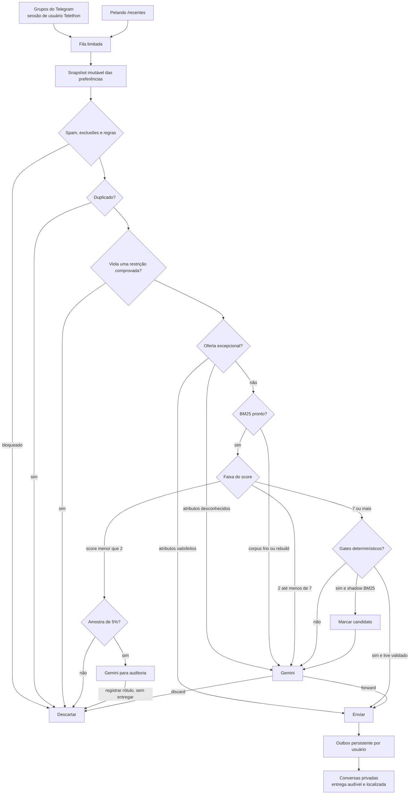

<p align="right">
  <a href="README.pt-BR.md"></a>
  <a href="README.md"></a>
</p>

<div align="center">

# Sieve

**Rastreador modular de promoções com preferências em linguagem natural, BM25 e inteligência artificial opcional.**

<p>
  <a href="#como-funciona">Como funciona</a> •
  <a href="#instalação-rápida">Instalação rápida</a> •
  <a href="#configuração-principal">Configuração</a> •
  <a href="#cli">CLI</a> •
  <a href="#testes">Testes</a>
</p>

<p>
  
  
  
  
  
</p>


</div>

> [!WARNING]
> **O Sieve está em beta e novas versões podem quebrar implantações existentes.** Fixe uma versão
> conhecida e não atualize um bot saudável sem revisar o [CHANGELOG.md](CHANGELOG.md). Faça backup
> do SQLite antes de atualizar. Para fazer downgrade, restaure o backup anterior à migração. O
> Sieve nunca exige nem armazena números de telefone.

O Sieve acompanha as fontes de promoções habilitadas, descarta o que não corresponde às suas
preferências privadas e envia cada promoção relevante de forma independente para cada membro
ativo. Ele foi
projetado para funcionar continuamente em hardware pequeno: processo único, filas limitadas,
SQLite em modo WAL e limite de memória do contêiner.

Para acompanhar algo, basta mandar uma mensagem ao bot. Você pode informar o nome do produto, preço
máximo, modelo ou atributo obrigatório, aliases e categorias que não deseja ver, sem editar a
configuração:

```text
Acompanhe o fone Sony WH-1000XM5 até R$ 1.800
Quero monitores OLED com pelo menos 144 Hz
Considere “placa de vídeo” e “GPU” a mesma coisa
Não quero promoções de perfumes
```

> [!IMPORTANT]
> A entrega de promoções é sempre ao vivo e com som. O autoencaminhamento BM25 mantém seu controle
> de calibração independente `off`/`shadow`/`live`; o `shadow` do BM25 registra candidatos, mas não
> cria entregas de teste.

Cada membro recebe um UUIDv4 imutável. O administrador cria convites com `/invite`; o membro resgata
o token de uso único em uma conversa privada com `/start <token>` e consulta seu UUID com
`/account`. Nomes, usernames e números de telefone não são usados como identidade.

## Como funciona



A ordem é intencional:

1. verificações fixas de spam e exclusões explícitas;
2. regras prioritárias `allow`/`deny`;
3. deduplicação persistente;
4. restrições determinísticas de preço e atributos;
5. tratamento de ofertas excepcionais;
6. relevância lexical ponderada com BM25 e roteamento por duas faixas;
7. gates determinísticos para candidatos fortes;
8. avaliação estruturada por inteligência artificial na faixa incerta e em shadow.

Uma violação de preço identificada com segurança nunca é ignorada por uma oferta “excepcional”. Se
uma oferta excepcional parece relevante, mas não é possível comprovar um atributo obrigatório, ela
vai ao Gemini em vez de ser descartada pelo BM25.

A avaliação de promoções pelo Gemini é opcional, mas a apresentação segura por Gemini é obrigatória
para toda promoção aceita. Com `pipeline.gemini_evaluation_enabled: false`, as mensagens de
preferência em linguagem natural ainda usam Gemini, mas a decisão sobre promoções fica determinística. Somente ofertas excepcionais
comprovadas e candidatos acima do limiar superior do BM25, aprovados por todos os gates e em modo
`live`, podem ser entregues. Casos intermediários ou incertos, corpus frio, rebuild de aliases,
auditorias e retries pendentes são descartados sem chamar Gemini.

Depois da aceitação, chamadas stateless separadas fazem extração, verificação independente contra
envenenamento, localização por `ui_language` e reescrita do motivo por usuário. A mídia nunca é
enviada ao modelo: fotos do Telegram e imagens do Pelando são validadas, limitadas a 10 MB,
armazenadas em `/state/media` e removidas quando todas as entregas terminam.

## Interface privada e acessível

O bot de entrega também oferece uma interface de preferências em inglês e português brasileiro. Na
primeira mensagem, o idioma do Telegram é usado como sugestão; depois, a escolha fica salva no
SQLite. Use `/language` a qualquer momento para trocar.

A interface foi feita para ser descoberta sem decorar comandos:

- `/start` apresenta o Sieve e mostra exemplos;
- botões com texto completo abrem **Preferências**, **Histórico**, **Ajuda** e **Idioma**;
- telas longas de preferências têm paginação;
- mensagens explicam o resultado e o próximo passo;
- HTML dá hierarquia visual sem depender somente de cor ou emoji;
- o menu de comandos é localizado pelo idioma do Telegram;
- textos dinâmicos são escapados antes da formatação.

Essas escolhas seguem os recursos oficiais de [formatação HTML e teclados inline da Bot
API](https://core.telegram.org/bots/api) e a orientação de descoberta por `/start`, `/help` e menu
de comandos em [Telegram Bot Features](https://core.telegram.org/bots/features).

Também é possível conversar naturalmente:

```text
Tenho interesse em monitores OLED até R$ 3.000
Não quero promoções de perfumes
Eu já tenho um PlayStation 5
Mostre minhas preferências
```

Atalhos determinísticos não usam Gemini:

| Comando | Resultado |
| --- | --- |
| `/preferences` | Mostra o estado autoritativo atual |
| `/history` | Mostra revisões recentes |
| `/preview <instrução>` | Interpreta e valida sem salvar |
| `/undo` | Desfaz a última mudança por meio de uma nova revisão |
| `/confirm <id>` | Confirma exatamente uma solicitação pendente |
| `/cancel <id>` | Cancela exatamente uma solicitação pendente |
| `/language` | Escolhe inglês ou português brasileiro |
| `/help` | Explica as opções e proteções |

Mudanças pequenas são aplicadas imediatamente. Regras de segurança, exclusões em massa, mudanças em
mais de cinco entradas, restaurações por data e `undo` com várias entradas exigem confirmação. Os
botões dizem **Confirmar alteração** e **Cancelar**, expiram em dez minutos e ficam inválidos quando
a revisão base muda. Um “sim” isolado nunca confirma uma operação destrutiva.

## A matemática

### Pontuação BM25

Para cada termo `t` da consulta de preferências e documento de promoção `d`, o Sieve usa Okapi BM25:

```text
score(q, d) = Σ IDF(t) · [ f(t,d) · (k₁ + 1) ]
                         ───────────────────────── · w(t)
                         f(t,d) + k₁ · (1 - b + b · |d| / avgdl)
```

onde:

- `f(t,d)` é a frequência do termo na promoção;
- `|d|` é o número de termos da promoção;
- `avgdl` é o tamanho médio das promoções do corpus;
- `k₁ = 1,2` controla a saturação da frequência;
- `b = 0,75` controla a normalização por tamanho;
- `w(t)` é o peso produzido pela importância da preferência.

A raridade do termo é:

```text
IDF(t) = ln(1 + (N - df(t) + 0,5) / (df(t) + 0,5))
```

`N` é o total de documentos no corpus e `df(t)` é quantos documentos contêm `t`. Portanto, um termo
raro como um modelo específico normalmente informa mais do que uma palavra comum como “oferta”.

### Importância de 0 a 100

A importância `I` de um interesse é convertida linearmente em multiplicador:

```text
w(I) = 0,5 + I / 100,     0 ≤ I ≤ 100
```

| Importância | Multiplicador | Interpretação |
| ---: | ---: | --- |
| `0` | `0,5×` | reduz pela metade a contribuição |
| `50` | `1,0×` | preserva o comportamento original |
| `100` | `1,5×` | aumenta em 50% a contribuição |

Aliases expandem os termos indexados sem alterar o texto original armazenado. Entradas de contexto
informam o Gemini, mas não tornam um produto lexicalmente relevante por conta própria.

### Por que os limiares são 2 e 7

BM25 não é porcentagem nem probabilidade: sua escala muda com `N`, `df(t)`, comprimento dos textos,
aliases e pesos. Quando uma promoção tem comprimento médio e um termo aparece uma vez, a fração de
saturação vale exatamente `1`:

```text
f = 1 e |d| = avgdl  →  f·(k₁+1) / (f+k₁) = 1
contribuição do termo ≈ IDF(t) · w(t)
```

No primeiro corpus considerado estável, com `N = 500`, alguns exemplos são:

| Frequência no corpus | `IDF(t)` | Contribuição com peso `1,0` |
| ---: | ---: | ---: |
| `df = 1` | `5,81` | `≈ 5,81` |
| `df = 10` | `3,87` | `≈ 3,87` |
| `df = 50` | `2,29` | `≈ 2,29` |

Assim, `2,0` elimina matches lexicais fracos, enquanto `7,0` separa uma faixa forte para medição.
Mas um único termo raríssimo com importância máxima pode contribuir `5,81 × 1,5 ≈ 8,72`; portanto,
`7,0` **não prova relevância sozinho**. O candidato também precisa corresponder literalmente a um
termo de um interesse estruturado, ter todas as restrições comprovadas e não parecer um acessório
quando o interesse é o produto principal. Aliases ajudam o BM25, mas não satisfazem sozinhos esse
gate literal.

Os defaults implementam uma política conservadora:

```text
score < 2,0       → descartar; 5% entram em auditoria Gemini sem possibilidade de entrega
2,0 ≤ score < 7,0 → Gemini decide
score ≥ 7,0       → aplicar gates; em shadow, marcar candidato e ainda deixar Gemini decidir
BM25 indisponível → Gemini decide
```

`7,0` é um ponto inicial experimental, não um ótimo matemático universal. O modo `live` só deve ser
ativado depois de pelo menos 300 candidatos shadow elegíveis sem falso encaminhamento confirmado:
com zero falhas em `n` observações, a regra dos três limita aproximadamente o risco superior de 95%
a `3/n`, ou cerca de `1%` quando `n = 300`. Mudanças de aliases e corpus frio desativam o caminho
BM25 e voltam a decisão ao Gemini.

### Restrições com três resultados

Preço e atributos são avaliados como `satisfeito`, `violado` ou `desconhecido`:

```text
violado    → descartar antes do bypass excepcional
satisfeito → a oferta excepcional pode seguir o bypass normal
desconhecido + oferta excepcional possivelmente relevante → enviar ao Gemini
```

Esse terceiro estado evita transformar ausência de informação em uma conclusão falsa.

### Limites deslizantes

Comandos que usam Gemini são contados em duas janelas persistentes:

```text
contagem(agora - 60 s, agora]  < 5
contagem(agora - 3600 s, agora] < 20
```

Prévias consomem o limite porque chamam o modelo. Consultas determinísticas, confirmações e mensagens
não autorizadas não consomem. O estado persiste após reinicializações.

## Instalação rápida

### Requisitos

- Docker com Docker Compose, ou Python 3.12+;
- credenciais de aplicativo do Telegram em [my.telegram.org](https://my.telegram.org);
- um bot criado pelo BotFather e uma conversa privada já aberta com ele;
- uma chave da API Gemini obrigatória, pois toda promoção aceita usa a apresentação isolada.

O Sieve usa duas identidades diferentes:

- a **conta de usuário** do Telethon lê os grupos e é autorizada por QR code;
- o **bot** entrega promoções e recebe comandos por Bot API usando IDs numéricos do Telegram e
  UUIDs internos.

### 1. Configuração

```powershell
Copy-Item .env.example .env
```

Preencha `.env` apenas com as credenciais das integrações que pretende ativar. Depois edite
`config/config.yaml`: configure perfil, aliases, regras, `chat_ids`,
`preferences.admin_telegram_user_id_env` e preferências; ative explicitamente somente as fontes,
a avaliação Gemini e o bot de preferências que pretende usar. A configuração rastreada começa com
todas as integrações externas desativadas. Nunca faça commit de tokens, chaves, estado SQLite ou
arquivos de sessão do Telegram.

### 2. Login único da conta que lê grupos

No PowerShell, execute o comando interativo:

```powershell
docker compose run --rm -it sieve --config /app/config/config.yaml `
  auth-telegram --source telegram-principal
```

Escaneie o QR code em **Telegram → Configurações → Dispositivos → Conectar Desktop**. Somente a
senha de 2FA pode ser solicitada. O bot de entrega usa `TELEGRAM_BOT_TOKEN` diretamente.

### 3. Validar e iniciar

```powershell
docker compose config
docker compose run --rm sieve --config /app/config/config.yaml validate-config
docker compose up -d --build
docker compose logs -f sieve
```

Se ativou o bot de preferências, abra a conversa privada com ele e envie `/start`.

Os logs JSON informam componente, tipo da exceção, status/código do provedor, falhas consecutivas,
tempo até nova tentativa e decisão de alerta sem registrar corpos de mensagens, contatos, tokens do
Telegram, usernames ou nomes de exibição.

## Preferências e persistência

No primeiro início de um banco novo, um perfil YAML não vazio vira uma nota-base sem perda, e
aliases e regras viram entradas individuais na revisão zero. A partir daí, SQLite é autoritativo;
o YAML não é reimportado automaticamente. Excluir o banco de preferências é o único caminho de
reseed automático. Em uma atualização, um placeholder antigo intacto é removido em uma única
revisão auditada do sistema; notas criadas pelo usuário e todas as preferências estruturadas são
preservadas.

Cada alteração cria uma revisão com mensagem original, ator, operações, resumo e snapshot completo.
Restaurações também criam novas revisões—o histórico aplicado nunca é apagado. No commit de uma
revisão, um novo snapshot imutável é trocado atomicamente: a promoção em andamento termina com o
snapshot anterior e a próxima já vê a mudança.

Mudanças de alias iniciam uma reconstrução geracional do índice em lotes de 250 documentos. Enquanto
ela está incompleta, BM25 falha aberto para Gemini para proteger o recall. O índice novo é ativado
atomicamente e o anterior é removido depois.

## Configuração principal

Edite o arquivo completo e rastreado [`config/config.yaml`](config/config.yaml). Todos os comandos
do Sieve usam esse único arquivo por padrão. Herança de configuração não é suportada. Segredos são
lidos de variáveis de ambiente.

### Atualização da configuração em camadas

Preserve a configuração existente antes de usar o novo exemplo:

```powershell
Move-Item config/config.local.yaml config/config.yaml
# Ou copie para manter o arquivo antigo:
# Copy-Item config/config.local.yaml config/config.yaml
```

Overrides antigos podem conter `extends` e omitir valores que vinham do arquivo-base; remova
`extends` e compare o arquivo migrado com `config/config.yaml`. Modos de runtime/fonte, chaves
antigas de proprietário/chat e o destino de chat no sink foram removidos e geram erro claro.

| Bloco | Responsabilidade |
| --- | --- |
| `runtime` | capacidade de fila, memória e alertas |
| `state` | caminho SQLite, retenção, corpus e tentativas |
| `pipeline` | opção de avaliação Gemini, limiares e modo BM25, auditoria, perfil, aliases e regras |
| `evaluator` | modelo Gemini, timeout e tentativas |
| `preferences` | administrador, `max_users`, polling, confirmações, limites e parser |
| `sink` | token do bot, API e timeout |
| `sources` | origens Telegram/Pelando habilitadas e configurações |

### Fontes de promoções suportadas

Todas as fontes começam desativadas no modelo copiado. Ative apenas os adaptadores configurados.

| Fonte | Cobertura | Padrão | Configuração necessária |
| --- | --- | --- | --- |
| Grupos/canais do Telegram | Qualquer grupo ou canal acessível à conta de usuário | Desativada | Credenciais do Telethon, sessão persistida e `chat_ids` |
| [Pelando `/recentes`](https://www.pelando.com.br/recentes) | Site de promoções voltado ao Brasil | Desativada | Sem conta; intervalo, timeout e user agent são opcionais |

Ative ou desative cada fonte separadamente em `config/config.yaml`:

```yaml
sources:
  - name: telegram-principal
    enabled: true
    settings:
      chat_ids: [-1001234567890]

  - name: pelando
    enabled: false
```

Pelo menos uma fonte precisa estar ativa antes de executar `run`. Para adicionar outro site,
implemente o protocolo `PromotionSource` e uma factory que receba as configurações, o `name`, o
cliente HTTP compartilhado e o health reporter; depois use o caminho `module:factory` em `sources`.
Não é necessário alterar o pipeline.

### Filtragem determinística de promoções

Para manter Gemini nas mensagens de preferência e não usá-lo para julgar promoções:

```yaml
pipeline:
  gemini_evaluation_enabled: false
  bm25_threshold: 2.0
  bm25_auto_forward_threshold: 7.0  # Ajuste para suas fontes e seu perfil
  bm25_auto_forward_mode: live      # Use shadow enquanto valida o limiar
```

Desativar a avaliação troca o fallback do Gemini por descarte. A escala do BM25 não é universal;
colecione evidências com replay e shadow e ajuste `bm25_auto_forward_threshold` manualmente antes de
usar `live`. Desativar a avaliação não desativa a apresentação das promoções aceitas;
`GEMINI_API_KEY` continua obrigatória.

## CLI

```text
sieve [--config ARQUIVO] [--log-level NÍVEL] run
sieve [--config ARQUIVO] auth-telegram [--source NOME]
sieve [--config ARQUIVO] smoke-telegram-preferences [--source NOME] [--session-path CAMINHO] [--timeout SEGUNDOS]
sieve [--config ARQUIVO] replay FIXTURE [--no-fail]
```

## Testes

```powershell
python -m pip install -e ".[test]"
python -m pytest
$env:RUN_SOAK="1"; python -m pytest -m soak
$env:SIEVE_RUN_GEMINI_CONTRACT="1"; $env:GEMINI_API_KEY="..."; python -m pytest -m contract
$env:SIEVE_RUN_SYSTEM="1"; python -m pytest -m system
```

Por padrão, os testes usam HTTP falso, relógios determinísticos e bancos temporários e não chamam
serviços reais. Os gates `contract` e `system` são opcionais. O primeiro valida o schema exato
contra Gemini; defina também `SIEVE_GEMINI_MODEL` para substituir o modelo padrão
`gemini-3.1-flash-lite`. O segundo exige o daemon do Docker, constrói a imagem de produção e usa
somente a pilha sintética `compose.system.yaml`, credenciais fictícias e um volume SQLite isolado.
A suíte cobre autorização, idiomas, formatação HTML, offsets, outbox, revisões, parsing estruturado, restrições,
BM25, reconstruções de aliases, integração e carga.

## Checklist pré-live

- [ ] Execute a suíte completa, incluindo contrato, recuperação e carga.
- [ ] Execute o gate Docker determinístico:
      `$env:SIEVE_RUN_SYSTEM="1"; python -m pytest -m system`.
- [ ] Mantenha apenas o autoencaminhamento BM25 em `shadow` até a evidência ser aceitável e revise
      as métricas de replay.
- [ ] Com o bot implantado em execução, execute o gate Telegram sem mutação:
      `docker compose run --rm sieve --config /app/config/config.yaml smoke-telegram-preferences --source telegram-principal`.
- [ ] Mude apenas `pipeline.bm25_auto_forward_mode` para `live`; fontes de promoção não têm modo.

O gate ao vivo descobre o usuário do bot pelo token configurado, confirma que a conta Telethon é a
proprietária das preferências, envia `/preferences`, usa uma solicitação `/preview` com nonce e
confirma que o estado autoritativo não mudou. Ele usa por padrão a sessão dedicada
`/state/telegram-smoke-user`; nunca reutilize o caminho da sessão de uma fonte. No primeiro uso, o
comando mostra um QR code e pode pedir a senha de 2FA; números de telefone não são aceitos. A saída
contém somente um relatório JSON conciso e qualquer timeout, webhook, identidade divergente, prévia
ambígua ou mudança de estado encerra o comando com falha. `--timeout` usa 90 segundos por padrão e
aceita de 10 a 300 segundos.

## Segurança operacional

- chat e remetente precisam corresponder ao UUID ativo antes de qualquer chamada ao Gemini;
- somente um administrador ativo pode convidar, listar, desabilitar ou reabilitar membros;
- o bot recusa iniciar o polling quando existe webhook ativo e não o remove automaticamente;
- respostas e offsets só avançam depois que o resultado e a resposta estão duráveis;
- a fila e o outbox têm capacidade limitada;
- o contêiner roda sem root, com sistema de arquivos somente leitura e capacidades removidas;
- entradas são limitadas a 500, estado a 128 KB e propostas a 25 operações.

## Licença

Disponível sob a [Licença MIT](LICENSE).
